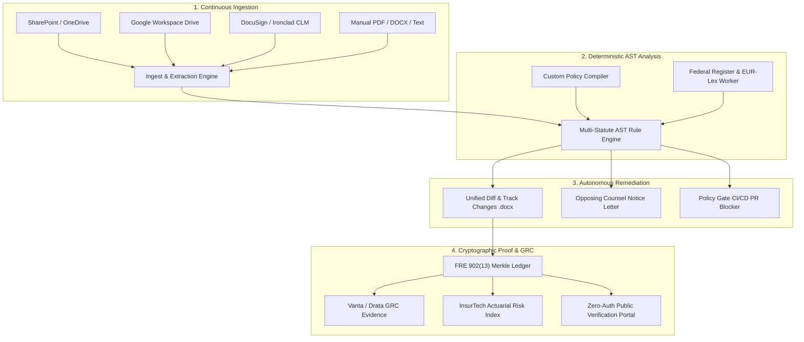

# § RegDiff — Autonomous Statutory Intelligence & Compliance Enclave

[](https://github.com/Basit-94/RegDiff)
[](https://python.org)
[](https://fastapi.tiangolo.com)
[](https://reactjs.org)
[](https://tailwindcss.com)
[](LICENSE)

> **When laws shift, your policies stay compliant.** RegDiff is an automated compliance intelligence platform that continuously ingests corporate agreements and handbooks, detects statutory breaches using deterministic AST engines, generates ready-to-merge Track Changes redlines, and anchors immutable attestation receipts to a cryptographic Merkle ledger.

---

## 🏛️ Core Capabilities

* 🔍 **Multi-Jurisdiction Statutory Matrix**: Built-in deterministic AST compliance engines covering **CFPB 1033**, **EU GDPR (Art. 33 & 17)**, **HIPAA § 164.312**, **CCPA / CPRA § 1798.130**, **NYDFS 23 NYCRR 500**, and **EU AI Act Article 14**.
* âš¡ **AST Policy-as-Code Compiler**: Custom rule engine allowing compliance and legal teams to author deterministic statutory rules with live test evaluations.
* 📝 **Autonomous Remediation & Track Changes**: Generates formal Opposing Counsel Notice letters and exports `.docx` redline packages with valid OpenXML `<w:del>` / `<w:ins>` revisions.
* 🛡️ **Policy Gate CI/CD**: Automated GitHub Action / GitLab CI pipeline gate that evaluates code and documentation pull requests, blocking non-compliant changes before merge.
* 🔗 **Enterprise Connectors**: Native bi-directional sync with **SharePoint**, **Google Drive**, **DocuSign / Ironclad CLM**, with automated triage ticket dispatch to **Jira** and **ServiceNow**.
* 📋 **Continuous GRC Evidence Sync**: Real-time attestation mapping for **Vanta**, **Drata**, and **Secureframe** SOC 2 Type II and ISO 27001 controls.
* 📑 **FRE 902(13) Immutable Ledger**: SHA-256 Merkle tree verification anchored to self-authenticating electronic record certificates for federal regulatory audits.
* 📈 **InsurTech Underwriting Index**: Actuarial cyber risk score computation (`94/100 A+`) providing cyber insurance premium discount verifications.
* 💻 **Microsoft Word 365 Add-in**: Live Office JS sidebar enclave enabling attorneys to audit clauses and insert redlines without leaving MS Word.

---

## 🏗️ Architecture



---

## 🚀 Quickstart

### Prerequisites
* **Python 3.11+**
* **Node.js 18+**
* **Git**

### 1. Clone & Setup Backend
```bash
git clone https://github.com/Basit-94/RegDiff.git
cd RegDiff

# Setup Python Virtual Environment
python -m venv backend/.venv
# Windows:
.\backend\.venv\Scripts\activate
# Linux/macOS:
source backend/.venv/bin/activate

# Install Dependencies
pip install -r backend/requirements.txt

# Run FastAPI Server
python -m uvicorn backend.main:app --port 8000 --reload
```

### 2. Setup Frontend
```bash
# In a new terminal
cd frontend
npm install
npm run dev
```
Open [http://localhost:5173](http://localhost:5173) in your browser.

---

## 🐳 Docker Deployment

Run the complete multi-tier enterprise stack (Postgres + pgvector, Redis, FastAPI backend, and Nginx React frontend) with a single command:

```bash
docker compose up --build
```

---

## 🧪 Testing Suite

RegDiff includes a comprehensive test suite with 100% pass rate:

```bash
# Run backend test suite
pytest backend/tests
```

---

## 📄 License & Intellectual Property
Copyright © 2026 **Abdul Basit Siddiqui**. All Rights Reserved.  
This project is proprietary and confidential. Unauthorized copying, modification, redistribution, or commercial use without explicit permission is strictly prohibited. See [`LICENSE`](LICENSE) for complete terms.
